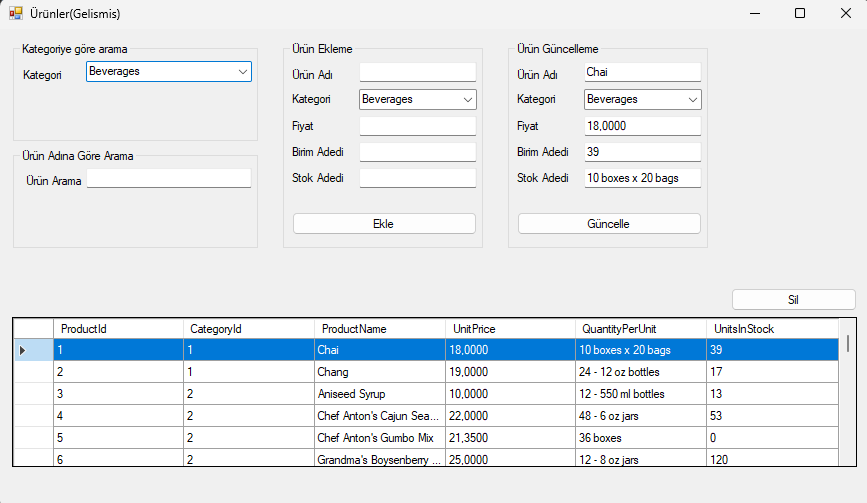

# NLayered-Project

Northwind veritabanı üzerinde CRUD işlemi yapmaktadır.  
Entity,DataAccess,Business ve Application katmanları mevcut.  

## 🚀 Çalıştırma
1. Repo’yu indirin  
2. NorthWind veritabanını yükleyin. 
3. Northwind.WebFormsUI içindeki AppConfig dosyasında connectionString="server=RIDVANKESKIN\SQLEXPRESS; initial catalog=Northwind; integrated security=true" olan yeri kendinize göre değiştirin.
4. Northwind.WebFormsUI seçerek başlatın.

## Veritabanı indirme linki
https://github.com/microsoft/sql-server-samples/tree/master/samples/databases/northwind-pubs

## 📸 Görsel

